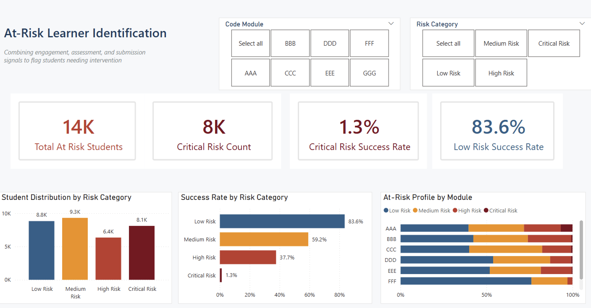

# Programme Health Intelligence: A Learning Analytics Case Study

End-to-end learning analytics project using SQL, Python, and Power BI to analyse learner engagement, completion rates, and outcome patterns across the Open University Learning Analytics Dataset (OULAD) — identifying the key factors that influence learner success and translating data into actionable decisions for learning operations teams.

---

## Background

Online education providers face a persistent operational challenge: by the time a learner's struggle becomes visible, it is often too late to intervene effectively. Assessment failures, disengagement, and withdrawal are rarely sudden — they leave signals in the data long before they become outcomes.

This project approaches that challenge from an operator's perspective. Rather than asking *"what predicts student success?"* as an academic exercise, it asks the questions a Head of Learning Operations would actually need answered:

- At what point in a programme do learners begin to disengage — and is there a consistent pattern?
- Which course modules are generating the most disengagement?
- How early can assessment data signal a learner at risk of withdrawal?
- Are certain demographic groups withdrawing at disproportionate rates, and what does that mean for enrolment and support strategy?
- What does a healthy programme look like in data terms — and which of our programmes fall short of that benchmark?

The goal is not just to analyse data but to produce insights that a non-technical stakeholder — a programme manager, a head of learning, an operations director — can act on.

---

## Fictional Business Scenario

**Client:** Head of Learning Operations at a mid-scale online education provider  
**Responsibility:** Academic programme performance and operational course health across multiple modules and student cohorts  
**Brief:** *"We have data on how our learners are behaving across every module. We need to understand what it's telling us, where our programmes are healthy, where they are not, and what we should do about it."*

This scenario is modelled on a realistic brief that would be given to a data analyst in an EdTech, higher education, or corporate L&D environment.

---

## Dataset

**Open University Learning Analytics Dataset (OULAD)**  
Publicly available at: [https://analyse.kmi.open.ac.uk/open_dataset](https://analyse.kmi.open.ac.uk/open_dataset)

The dataset covers 7 unique modules across 22 module-presentation combinations, 32,593 enrolment records (28,785 unique students), and spans two academic years (2013–2014). It contains anonymised data on student demographics, registration, assessment scores, virtual learning environment (VLE) interactions, and final outcomes.

> **Note on student count:** Students who studied more than one module appear more than once in the dataset. 32,593 is the enrolment count; 28,785 is the unique student count. Both figures are used in the analysis depending on context.

| File | Rows | Description |
|---|---|---|
| `studentInfo.csv` | 32,593 | Student demographics and final results |
| `studentRegistration.csv` | 32,593 | Registration and withdrawal dates |
| `studentAssessment.csv` | 173,912 | Assessment scores per student |
| `assessments.csv` | 206 | Assessment types, weights, and deadlines |
| `studentVle.csv` | 10,655,280 | Daily clicks on learning materials |
| `vle.csv` | 6,364 | VLE activity types and classifications |
| `courses.csv` | 22 | Course length and module information |

---

## Tools & Technologies

| Tool | Purpose |
|---|---|
| Python (pandas, matplotlib, seaborn) | Data cleaning, EDA, visualisation |
| SQL | Data querying and aggregation |
| Power BI | Interactive dashboard |
| Jupyter Notebook | Analysis documentation |
| GitHub | Version control and project presentation |

---

## Project Structure

```
├── data/
│   ├── raw/                  # Original OULAD CSV files (unmodified)
│   └── processed/            # Cleaned and transformed data
├── notebooks/
│   ├── 01_student_overview.ipynb        # Outcomes and demographics analysis
│   ├── 02_engagement_analysis.ipynb     # VLE engagement vs outcomes
│   ├── 03_dropout_timing.ipynb          # When and why students withdraw
│   ├── 04_assessment_performance.ipynb  # Assessment scores vs final results
│   ├── 05_at_risk_identification.ipynb  # Combined at-risk pattern analysis
│   └── 06_sql_queries.ipynb             # SQL queries against SQLite
├── sql/
│   ├── engagement_summary.sql           # Aggregate engagement by module
│   ├── assessment_thresholds.sql        # Flag students below score threshold
│   ├── withdrawal_by_demographic.sql    # Withdrawal rates by group
│   └── student_activity_ranking.sql     # Rank students by activity level (window functions)
├── dashboard/
│   └── programme_health_dashboard.pbix  # Power BI dashboard — 3 pages
├── images/
│   ├── 01-13_*.png                      # Chart outputs from notebooks
│   └── dashboard_screenshot.png         # Dashboard preview for README
├── reports/
│   ├── Business_Requirements_Document.md
│   └── findings_and_recommendations.md  # 23 findings, operational recommendations
│   └── project_summary.pdf              # One-page stakeholder-friendly summary
├── presentation/
│   ├── dashboard_page1_overview.png
│   ├── dashboard_page2_engagement.png
│   ├── dashboard_page3_atrisk.png
├── .gitignore
└── README.md
```

---

## Analysis Questions

Each notebook addresses a specific business question, not just a technical one:

1. **Student Overview** — What do pass, fail, and withdrawal rates look like across courses and demographic groups? Where are the concentration points?
2. **Engagement Analysis** — How does VLE interaction correlate with final outcomes? Is there a minimum engagement threshold below which failure becomes likely?
3. **Dropout Timing** — At what point in a programme do students typically disengage or withdraw? Is there a critical window for intervention?
4. **Assessment Performance** — How strongly do early assessment scores predict final results? How much warning does the data give us?
5. **At-Risk Identification** — Which combination of factors — engagement, demographics, assessment scores — is most associated with poor outcomes?

---

## Approach

What distinguishes this analysis is the operator's lens applied throughout. Every chart, query, and finding is framed around a decision a learning operations team would need to make — not around demonstrating technical technique for its own sake. Findings are followed by specific, actionable recommendations grounded in the realities of running online programmes at scale.

---

## Key Findings & Recommendations

The full findings report — 23 findings spanning programme performance, engagement,
dropout timing, assessment prediction, and the at-risk framework — is available in
[`reports/findings_and_recommendations.md`](reports/findings_and_recommendations.md).

**Headline finding:** 52.8% of enrolments do not result in a successful outcome.
A three-signal at-risk framework (engagement, assessment score, submission timing)
identifies students with a 98.7% fail/withdrawal rate at Critical Risk versus an
83.6% success rate at Low Risk — an 82 percentage point gap confirming the
framework is operationally reliable.

---

## Dashboard Preview

The Power BI dashboard consists of 3 pages, each addressing a different layer of the analysis:

**Page 1 — Programme Health Overview**
KPI cards for total enrolments, pass/fail/withdrawal/distinction rates, an outcome distribution chart, and withdrawal rate by module — filterable by module.

**Page 2 — Engagement & Assessment Analysis**
Success rate by engagement band, score band, and submission behaviour — showing exactly where the data-driven intervention thresholds lie.

**Page 3 — At-Risk Framework**
The combined three-signal at-risk framework in action — risk category distribution, success rate by risk category, and at-risk profile by module — filterable by module and risk category.



*Additional page screenshots available in `presentation/`.*

---

## How to Run

1. Clone the repository:
   ```bash
   git clone https://github.com/mcube-techno/learner-engagement-analysis.git
   ```

2. Install dependencies:
   ```bash
   pip install pandas matplotlib seaborn jupyter
   ```

3. Place the raw OULAD CSV files in `data/raw/`
   > **Note:** `studentVle.csv` (454MB, 10.6M rows) is excluded from this repository due to its size. It must be downloaded directly from the OULAD website and placed in `data/raw/` before running the notebooks. All other files are available in `data/raw/` within this repo. A stratified 10% sample of `studentVle.csv` is available in `data/processed/studentVle_sampled.csv` and is what the notebooks use by default.
   
4. Run notebooks in order, starting with `01_student_overview.ipynb`

---

## Status

| Component | Status |
|---|---|
| Business Requirements Document | ✅ Complete |
| Data ingestion & cleaning | ✅ Complete |
| Exploratory analysis (Notebooks 1–5) | ✅ Complete |
| SQL queries | ✅ Complete |
| Power BI dashboard (3 pages) | ✅ Complete |
| Findings & recommendations report | ✅ Complete |
| Stakeholder summary PDF | ✅ Complete |

---

## Author

**Megha Sinha**  
[LinkedIn](https://www.linkedin.com/in/megha-sinha-0a3a1a26a/) | mail2megha.tech@gmail.com
